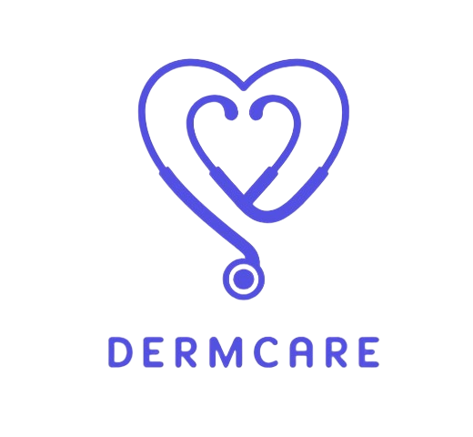

# DermCare

<!--
**DermCare/DermCare** is a ✨ _special_ ✨ repository because its `README.md` (this file) appears on your GitHub profile.

Here are some ideas to get you started:

- 🔭 I’m currently working on ...
- 🌱 I’m currently learning ...
- 👯 I’m looking to collaborate on ...
- 🤔 I’m looking for help with ...
- 💬 Ask me about ...
- 📫 How to reach me: ...
- 😄 Pronouns: ...
- ⚡ Fun fact: ...
-->

  

### Theme

Health Innovation: Empowering Vulnerable Communities for Health and Well-being

### Project Title

DermCare

### Project Description and Objective

DermCare is a capstone project focused on developing an AI-powered tool to assist individuals with skin diseases in obtaining accurate diagnoses more efficiently. Leveraging machine learning, DermCare analyzes user-uploaded images and recommends suitable drugs to alleviate symptoms or even cure the condition. Unlike other products, DermCare stands out by providing precise disease detection, visualising disease progression, and maintaining a comprehensive skin health history. Notably, DermCare includes a unique feature, which is a drug recommendation system coupled with online drug purchasing.

### Our Team

| **Bangkit ID** | **Name**             | **University**                   | **Learning Path**  | **Profile** |
|:--------------:|:--------------------:|:--------------------------------:|:------------------:|:-----------:|
|  M006D4KX2697  | Aghnia Azka Privanna |       Universitas Brawijaya      |  Machine Learning  |[LinkedIn](https://www.linkedin.com/in/aghnia-azka-privanna-9a1662217/) [GitHub](https://github.com/azka0210ap)|
|  M189D4KX2078  |  Rizky Putri Pratiwi |       Universitas Bengkulu       |  Machine Learning  |[LinkedIn](https://www.linkedin.com/in/rzkyputrip/) [GitHub](https://github.com/rzyputrip)|
|  M006D4KX1751  |     Clara Carissa    |       Universitas Brawijaya      |  Machine Learning  |[LinkedIn](https://www.linkedin.com/in/clara-carissa-390874220/) [GitHub](https://github.com/chomeong)|
|  C297D4KY0642  |  Rayhan Naufal Anwar |      UPN Veteran Yogyakarta      |   Cloud Computing  |[LinkedIn](https://www.linkedin.com/in/rayhannaufala/) [GitHub](https://github.com/rayhannaufal)|
|  C189D4KX0119  |     Novia Evianti    |       Universitas Bengkulu       |   Cloud Computing  |[LinkedIn](https://www.linkedin.com/in/novia-evianti-9ba001293/) [GitHub](https://github.com/noviaevianti)|
|  A152D4KY4476  |  Bobi Permana Sandi  | Sekolah Tinggi Teknologi Bandung | Mobile Development |[LinkedIn](https://www.linkedin.com/in/bobi-permana-sandi/) [GitHub](https://github.com/bobipermanasandii)|
|  A006D4KY3925  |   Aldy Imam Wijaya   |       Universitas Brawijaya      | Mobile Development |[LinkedIn](https://www.linkedin.com/in/aldyimamwijaya/) [GitHub](https://github.com/aldyimam03)|

### Application Demo

[https://bit.ly/DemoDermCare](https://bit.ly/DemoDermCare)
